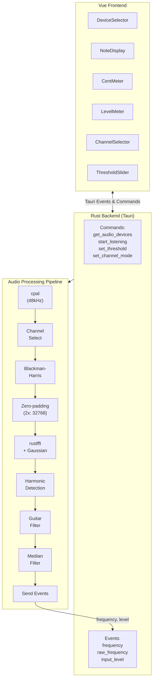

# AGENTS.md

Project information for AI/automation agents.

## Project Overview

Guitar tuner app built with Tauri v2 + Vue 3 + Rust (Windows target).

## Architecture Diagram



## Architecture

### Rust Backend (`src-tauri/src/lib.rs`)

- **cpal**: Audio input stream (48kHz, stereo)
- **rustfft**: FFT analysis
- **Global State**: `STREAM`, `THRESHOLD_RATIO`, `CHANNEL_MODE`, `STOP_FLAG`
- **Tauri Commands**: `get_audio_devices`, `start_listening`, `set_threshold`, `set_channel_mode`
- **Events**: `frequency`, `raw_frequency`, `input_level`

### Audio Processing Pipeline

1. Audio input via cpal (48kHz, stereo)
2. Channel selection (L/R/Both)
3. Apply Blackman-Harris window function
4. 2x zero-padding (FFT 16384 → 32768)
5. Execute FFT, calculate power spectrum (75-350Hz range)
6. Gaussian interpolation for peak frequency estimation
7. Harmonic detection (check 1/2, 1/3, 1/4) prioritizing fundamental
8. Guitar tone filter (E2-E4 ±15% range)
9. Median filter for stabilization
10. Send events to frontend

### Vue Frontend (`src/App.vue`)

- Device selection dropdown
- Note name & frequency display (current and target values)
- Cent meter (±50 cents, horizontal bar)
- Level meter (-80dB to 0dB)
- Channel selection buttons (L/L+R/R)
- Sensitivity slider

## Important Notes

### Rust Closure Syntax

```rust
// ✅ Correct
let buffer_clone = buffer.clone();
device.build_input_stream(
  &config,
  move |data: &[f32], _| { /* ... */ },
  err_fn,
  None
)

// ❌ Wrong (unnecessary block)
device.build_input_stream(
  &config,
  { move |data: &[f32], _| { /* ... */ } },  // Don't wrap in block
  err_fn,
  None
)
```

### Stream Retention

cpal streams stop callbacks when dropped, so retain globally:

```rust
static STREAM: Lazy<Mutex<Option<Stream>>> = Lazy::new(|| Mutex::new(None));
```

### If Callbacks Aren't Called

- Windows "Sound Settings" → "Recording" → Disable exclusive mode
- Close other DAW/recording apps
- Try a different input device

## CI & Version Management

- Node.js/Rust versions managed via `.mise.toml`, auto-applied in CI (GitHub Actions)
- Tag push generates Windows installer draft on GitHub Releases

### Development Commands

```bash
mise install        # Node.js/Rust version management
npm install         # Install dependencies
npm run tauri dev   # Development mode
npm run tauri build # Release build
```
